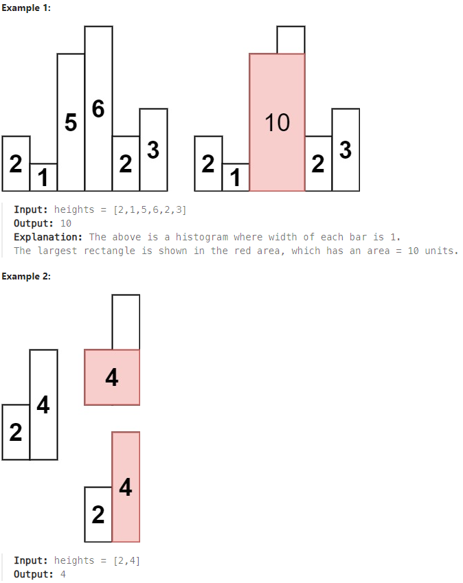

## Largest Rectangle in Histogram (Leetcode Question 84)

### Question
Given an array of integers heights representing the histogram's bar height where the width of each bar is 1, return the area of the largest rectangle in the histogram.

**Constraints:**

- `1 <= heights.length <= 10^5`

- `0 <= heights[i] <= 10^4`